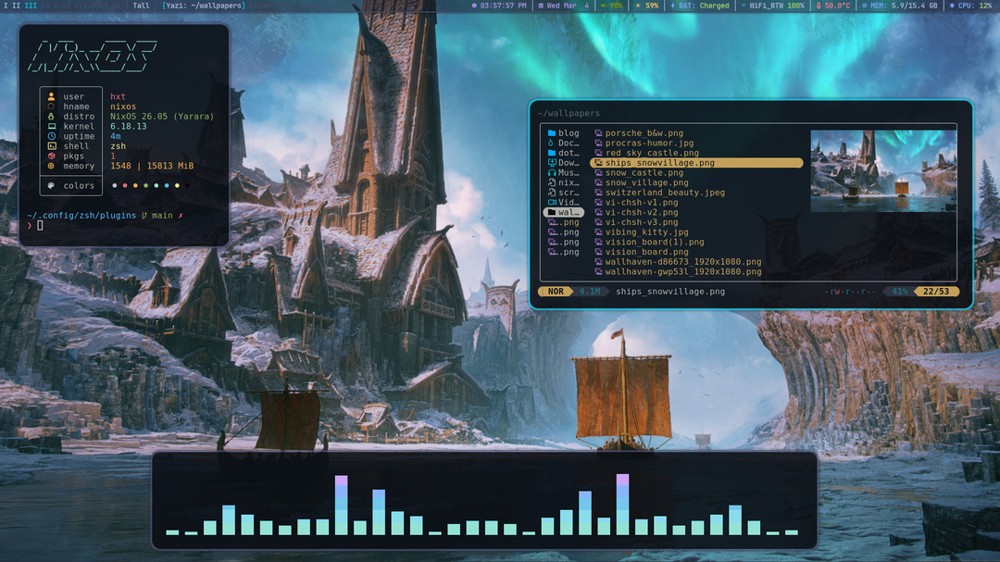
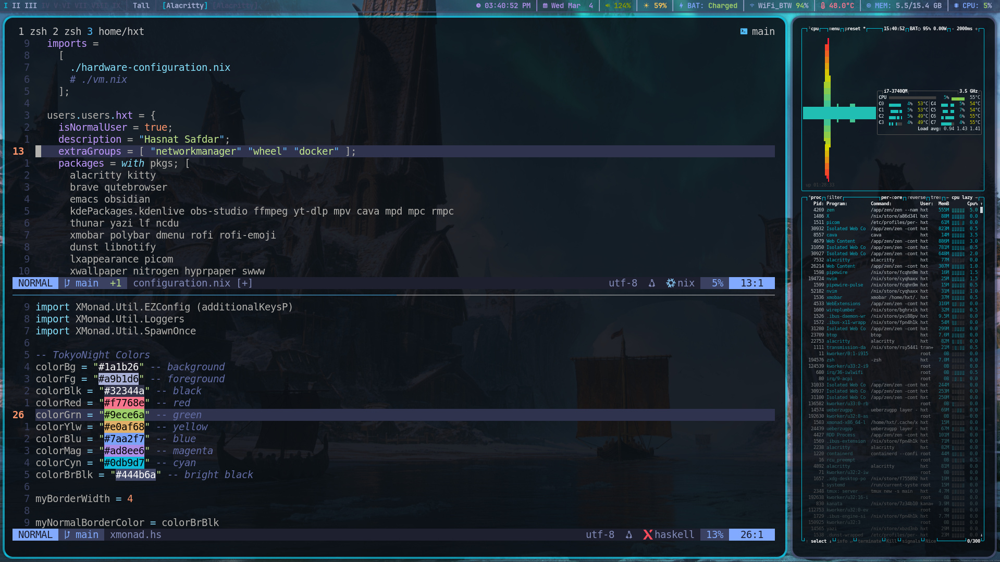
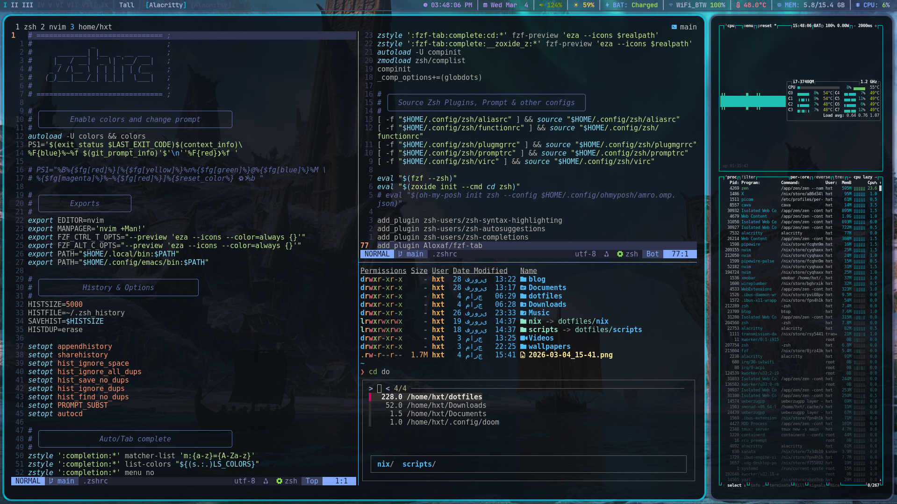

# Actually Functional Dotfiles for my **󱄅  NiXMonad Workstation** PC.





Here’s a shorter, clean, slightly informal version:

---

#  NixOS + XMonad Dotfiles

My personal **NixOS + XMonad** setup.
Minimal, keyboard-driven, flake-based, and reproducible.

## 🧰 Stack

* NixOS (flakes)
* XMonad + Xmobar
* Kanata (Home-row mods)
* Alacritty
* Neovim
* Zsh (No Bloated Plugin Manager)
* Tmux (No Plugin Manager)
* Picom, Dunst, Btop, Yazi, etc.

## 📦 Manage with GNU Stow

I use **GNU Stow** to manage symlinks.

Clone the repo:

```bash
git clone https://github.com/hasnatsafdar/dotfiles.git
cd dotfiles
```

Stow what you need:

```bash
stow .
```

Or individual packages:

```bash
stow nvim
stow xmonad
stow zsh
```

## 🧊 NixOS Config

System config lives in:

```
nix/
```

Rebuild with flakes:

```bash
sudo nixos-rebuild switch --flake .#hostname
```

### Work in progress:
- neomutt
- transmission
- gopass setup
- KVM/QEMU setup (the nix way)
- emacs.obsidian (org-mode, org-roam for project management, thinking, writing etc)
- integrating the pure suckless stack (dmenu, st, etc)
- Nushell ?? Maybe...
